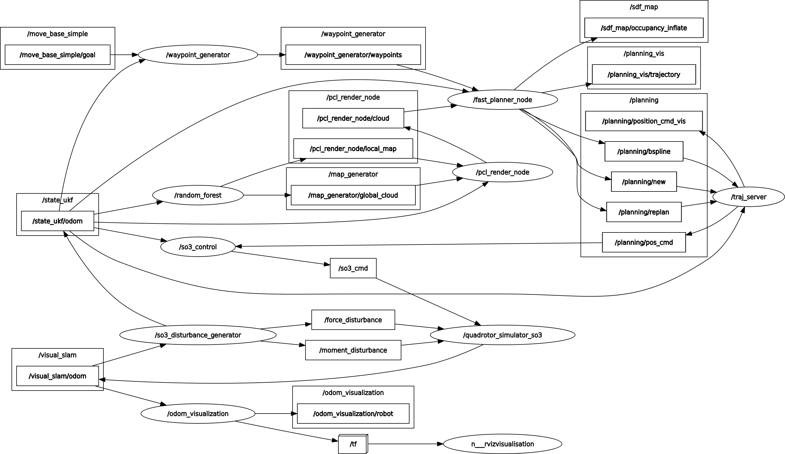

# FAST-Planner plan_manage

plan_manage 是Fast-Planner的核心包，相当于程序进入的接口，启动。

如何分析一个大型的ros包（含有若干个小ros package的包）：

* 首先看cmakelist，分析exe和源代码的链接关系，第三方库的依赖关系，找到每个功能包的核心文件（如果有）
* 其次分析数据流向，也就是分析，整个功能包完成了什么任务，需要读取什么数据，最后输出什么数据（看做函数，比较容易）；之后详细分析是在哪几个类和函数之间传递的（比较复杂），明白哪个函数和类是做什么的，完成了什么；
* 最后详细分析某几个函数和类，总结一些基本的写法和技巧；

## 0. CMakeList Analysis

如果是ros noetic，需要改用std=c++14，而不是原本的11

第三方package依赖：

* Eigen3
* PCL1.7

catkin功能包依赖：

```cmake
find_package(catkin REQUIRED COMPONENTS
    roscpp
    std_msgs
    geometry_msgs
    quadrotor_msgs
    plan_env
    path_searching
    bspline
    bspline_opt
    traj_utils
    message_generation
    cv_bridge
)
```

其中，quadrotor_msgs是定义的四旋翼消息类型，参考了四旋翼的微分平坦特性；其余有原ros和一些Fast-Planner包含的包；

包括消息类型：FILES指此msg文件在msg文件夹下

```cmake
# Generate messages in the 'msg' folder
add_message_files(
    FILES
    Bspline.msg
)
```

添加消息的依赖：

```cmake
# Generate added messages and services with any dependencies listed here
generate_messages(
    DEPENDENCIES
    std_msgs
    geometry_msgs
)
```

查阅定义的Bspline.msg，不难理解（因为调用了这两者消息类型）：

```
int32 order
int64 traj_id
time start_time

float64[] knots
geometry_msgs/Point[] pos_pts

float64[] yaw_pts
float64 yaw_dt
```

主要包含次数，轨迹的ID，开始的时间，位置节点向量，位置控制点，偏航角控制量，==偏航角导数==(偏航角的相关没怎么在论文里见到)？

include directories:

```cmake
include_directories(
    include
    SYSTEM
    ${catkin_INCLUDE_DIRS} ${PROJECT_SOURCE_DIR}/include
    ${EIGEN3_INCLUDE_DIR}
    ${PCL_INCLUDE_DIRS}
)
```

add executable and link libraries:

```cmake
add_executable(fast_planner_node
    src/fast_planner_node.cpp
    src/kino_replan_fsm.cpp
    src/topo_replan_fsm.cpp
    src/planner_manager.cpp
)
target_link_libraries(fast_planner_node 
    ${catkin_LIBRARIES}
)
```

除最主要的`fast_planner_node`以外，plan_manage还有另一个可执行文件：

```cmake
add_executable(traj_server src/traj_server.cpp)
target_link_libraries(traj_server ${catkin_LIBRARIES})
add_dependencies(traj_server ${${PROJECT_NAME}_EXPORTED_TARGETS})
```

traj_server大概率是为整体轨迹提供服务；

综上，plan_manage有两个ros节点，一个是Fast planner主节点，另一个是为轨迹提供服务的traj_server节点。

## 1. Data Flow and Function

首先关注整个planner在仿真环境下运行时的ros节点与话题图：



关于**planner**的内容主要集中在右上角；

Fast Planner，包括之后的EGO Planner，对于位姿估计和建图都大致相似，有两种方案：

* 位姿估计使用里程计消息类型Odometry，地图使用点云PointCloud2类型（仿真默认使用的是这种）
* 位姿估计使用PoseStamped类型，地图使用深度图Sensor_msg/Image类型（可能有所出入，基本是这样）

其中，**fast_planner_node**订阅了位姿，地图和waypoints：

* 位姿估计和建图已经清楚；
* `waypoints_generator/waypoints`来自节点waypoint_generator，该节点除了订阅了rviz交互提供的`/move_base_simple/goal`话题（在rviz中给定目标点），还订阅了里程计话题，也就是相当于给起点和终点；

**fast_planner_node**节点发布的话题有：

* `/sdf_map/occupancy_inflate`，膨胀后的SDF地图
* `planning_vis/trajectory`，应该是rviz中可视化的轨迹
* `planning/bspline`，发布的B样条曲线轨迹
* `/planning/new`
* `/planning/replan`

之后在**traj_server**节点，订阅的话题有：

* `/planning/new`
* `/planning/replan`
* `/planning/bspline`
* `/state_ukf/odom`

**traj_server**节点发布的话题有：

* `/planning/pos_cmd`，此话题的消息类型为定义的 *quadrotor_msgs*
* `/planning/position_cmd_vis`，应该是在rviz中可视化离散位置控制点的

### 1.1 fast_planner_node.cpp

上来一个看不懂的关于signal的头文件backward.hpp

```cpp
using namespace fast_planner;

int main(int argc, char** argv) {
    ros::init(argc, argv, "fast_planner_node");
    ros::NodeHandle nh("~");

    int planner;
    nh.param("planner_node/planner", planner, -1);

    TopoReplanFSM topo_replan;
    KinoReplanFSM kino_replan;

    if (planner == 1) {
        kino_replan.init(nh);
    } else if (planner == 2) {
        topo_replan.init(nh);
    }

    ros::Duration(1.0).sleep();
    ros::spin();

    return 0;
}
```

作者在README中提到，有两个不同的模式：

* kino_replan: In this method, a kinodynamic path searching finds a safe, dynamically feasible, and minimum-time initial trajectory in the discretized control space.  Then the smoothness and clearance of the trajectory are improved by a B-spline optimization.
* topo_replan: This method features searching for multiple trajectories in distinctive topological classes. Thanks to the strategy, the solution space is explored more thoroughly, avoiding local minima and yielding better solutions.

综上，fast_planner_node选择使用kino和topo的一种，之后调用其init函数；

### 1.2 kino_replan_fsm.cpp

